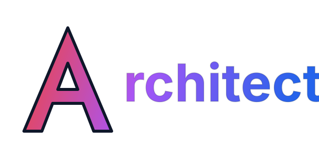

<div align="center">
  
  <p>Production-grade Codex skills and plugin package for architecture, evidence-backed OSS selection, gate-driven review, and release-minded build guidance.</p>
  <p>
    
    
    
    
  </p>
</div>

> [!IMPORTANT]
> Meta-Architect `v0.1.3` is a production-grade skills line.
> It is not a lightweight demo branch.
> From `v0.1.3` onward, the package is expected to ship with stable skill contracts, deterministic packaging, explicit release gates, and honest install and publish surfaces.

## Overview

Meta-Architect is a workflow layer for teams that want architecture, evidence, review, and release discipline before build execution.

It adds:

- an architecture-first lane before implementation
- evidence-backed OSS selection through GitMCP-connected sources
- explicit logic, security, and DX/UX review gates
- installable skills and a reproducible package surface

> [!NOTE]
> Meta-Architect does not replace your coding runtime.
> It wraps that runtime with architecture, evidence, gate enforcement, and release-sensitive workflow control.

<table>
  <tr>
    <td><strong>npm package</strong></td>
    <td><code>@jstn-sdk/ma</code></td>
  </tr>
  <tr>
    <td><strong>Helper command</strong></td>
    <td><code>ma</code> (secondary support surface)</td>
  </tr>
  <tr>
    <td><strong>Runtime</strong></td>
    <td>Node.js <code>&gt;=20</code>, npm <code>@10</code></td>
  </tr>
  <tr>
    <td><strong>Release line</strong></td>
    <td><code>v0.1.3</code></td>
  </tr>
  <tr>
    <td><strong>License</strong></td>
    <td><a href="./LICENSE">MIT</a></td>
  </tr>
</table>

## Prerequisites

- Node.js `>=20`
- npm `>=10`
- Git
- an MCP-capable coding runtime
- Codex for the recommended package-first path
- macOS, Linux, or WSL2 recommended

> [!TIP]
> The most reliable default environment is a Unix-like shell with Git, Node.js, and an MCP-capable runtime already configured.

## Recommended Default Flow

Meta-Architect is intended to be consumed as an installed package, not primarily as a git clone.

Primary product path:

```bash
# Install
npm i -g @openai/codex@latest @jstn-sdk/ma@latest

# Start Codex context if needed
ma --madmax --high

# Remove Meta-Architect only
npm uninstall -g @jstn-sdk/ma

# Remove Meta-Architect and Codex
npm uninstall -g @jstn-sdk/ma @openai/codex
```

What this assumes:

- Codex is installed globally
- Meta-Architect is installed globally as the skills/plugin package
- Meta-Architect installs its published skill surface into the active Codex home
- the product experience happens through the skill workflow inside Codex

> [!IMPORTANT]
> The recommended default flow is package-first.
> The git clone path is for contributors and maintainers, not the main user-facing install story.

## Repository Branch Strategy

Meta-Architect’s repository workflow follows a stricter release posture focused on gated promotion:

- `main` = release-facing protected branch
- `development` = normal integration branch
- `feature/*` = short-lived contribution branches
- contributors branch from `development`
- normal PRs target `development`
- only curated promotions move `development` into `main`

> [!CAUTION]
> `main` is intended to be protected and exceptional.
> Maintainers should stop bypass-pushing to `main` except for genuine emergency or admin recovery cases.

## Setup

### Package setup

Install the consumer package directly:

```bash
# Install
npm i -g @openai/codex@latest @jstn-sdk/ma@latest

# Launch
ma --madmax --high

# Remove Meta-Architect only
npm uninstall -g @jstn-sdk/ma

# Remove Meta-Architect and Codex
npm uninstall -g @jstn-sdk/ma @openai/codex
```

This gives you:

- the installed Meta-Architect skill surface
- the canonical Meta-Architect skill entrypoints inside a Codex session
- the optional `ma` helper command when a guided start is useful

### Contributor setup: source checkout

Use this path only if you want to work on Meta-Architect itself.

```bash
git clone https://github.com/JustineDevs/meta-architect.git
cd meta-architect
npm install
npm link
```

`npm link` makes `ma` and `meta-architect` available from the local checkout.

## Quick Start

### 1. Start Codex context if needed

```bash
ma --madmax --high
```

### 2. Start with the real usage-workflow prompt

Use the same operator shape defined in [example/usage-workflow.md](./example/usage-workflow.md).

Quick-start prompt:

```text
$arch I want to build: [PROJECT IDEA]

Context:
- Product type: [web app / mobile app / API / marketplace / agent system / internal tool]
- Users: [who will use it]
- Core problem: [what problem it solves]
- Main features:
  1. [feature one]
  2. [feature two]
  3. [feature three]
- Constraints:
  - Budget: [low / medium / high]
  - Team size: [solo / small / medium]
  - Timeline: [e.g. 2 weeks MVP, 3 months beta]
  - Preferred stack: [optional]
  - Avoid: [optional]
- Quality priorities:
  - [e.g. speed, low cost, security, DX, maintainability, scalability]
- Deployment target:
  - [Vercel / Docker / VPS / AWS / GCP / local-first / hybrid]

Required output:
1. Problem framing
2. Recommended architecture
3. Stack decision with justification
4. System components and responsibilities
5. Data model and storage choices
6. Auth/security considerations
7. DX/UX considerations
8. Delivery plan for v0.1.3
9. Risks and trade-offs
10. Decision log
11. Exact next trigger to run after this
```

### 3. Run the full trigger sequence inside Codex

After `$arch`, continue exactly like the usage workflow:

```text
$sage
$flow
$vet
$vibe
$build
```

See [example/usage-workflow.md](./example/usage-workflow.md) for the full prompt templates for each step.

### 4. Secondary helper path

If you are working from a repository directly and need scaffolded local support files, use:

```bash
ma setup
ma
```

Expected output for `ma setup`:

```text
meta-architect setup
====================
ready: .codex/agents
ready: .codex/prompts
ready: .ma/skills
ready: .ma/evidence
ready: .ma/context
ready: .ma/specs
ready: .ma/plans
ready: mcp
ready: docs
ready: docs/qa
ready: sprint
```

### 5. Configure GitMCP sources

Add real repository-backed endpoints in `mcp/servers.json`.

Example:

```json
{
  "category": "meta-list",
  "repo": "sindresorhus/awesome",
  "endpoint": "https://gitmcp.io/sindresorhus/awesome"
}
```

Recommended starter endpoints:

- `https://gitmcp.io/sindresorhus/awesome`
- `https://gitmcp.io/dzharii/awesome-typescript`
- `https://gitmcp.io/sbilly/awesome-security`

> [!IMPORTANT]
> Verified release evidence must come from repository-form GitMCP endpoints such as `https://gitmcp.io/{owner}/{repo}`.
> A generic documentation endpoint such as `https://gitmcp.io/docs` does not count as VERIFIED evidence for build unlocking.

### 6. Secondary helper flow outside Codex

If you need scripted repo-local validation rather than the interactive runtime workflow:

```bash
ma idea "Build a real-time collaborative whiteboard for product teams"
ma run '$arch'
ma run '$sage'
ma run '$flow'
ma run '$vet'
ma run '$vibe'
ma status
ma run '$build'
```

Expected status before the helper-path `$build`:

```text
Meta-Architect Status
=====================
Idea: CLEAR
Architecture: APPROVED
Evidence: VERIFIED
Logic: GREEN
Security: GREEN
Experience: GREEN
Build: LOCKED
Next allowed triggers:
$build
```

Expected helper-path build output:

```text
Build gate is green.
Suggested branches:
- feature/ui
- feature/api
Optional worktree commands:
git worktree add ../ui feature/ui
git worktree add ../api feature/api
```

### 7. Simple command guide

Meta-Architect has two surfaces.

- terminal helper commands
- in-session skills

Terminal commands are normal shell commands you run in the terminal:

```bash
ma setup
ma init
ma idea "Build a product"
ma status
ma run '$arch'
```

In-session skills are prompts you use inside the Codex conversation after launch:

```text
$arch
$sage
$flow
$vet
$vibe
$build
```

Plain-language difference:
- `ma ...` = helper commands in the terminal
- `$...` = the product experience inside Codex

What `ma setup` and `ma init` do:
- both currently do the same thing
- they create the local support files and folders
- they prepare `.ma/` runtime files such as context, specs, plans, evidence, and runbook files
- they do not run the skill workflow by themselves

What to use when:
- use Codex and run the skills in-session
- use `$arch -> $sage -> $flow -> $vet -> $vibe -> $build` inside the Codex session
- use `ma setup` or `ma init` only when you want local scaffolding or scripted helper automation from the terminal
- use `ma sdk-path` when you need the exact installed support-bundle path for packaged prompts, MCP files, sprint files, scripts, plugin metadata, or templates

## Core Maintainers

<table>
  <tr>
    <td><strong>Role</strong></td>
    <td><strong>Name</strong></td>
    <td><strong>GitHub</strong></td>
  </tr>
  <tr>
    <td>Creator / Maintainer</td>
    <td>JustineDevs</td>
    <td><a href="https://github.com/JustineDevs">@JustineDevs</a></td>
  </tr>
</table>

## Core Triggers

| Trigger | Purpose | Main output | Gate effect |
| --- | --- | --- | --- |
| `$arch` | Produce the first-pass architecture blueprint | decision entry | `architecture_status = APPROVED` |
| `$sage` | Ground major choices in configured GitMCP evidence | evidence records | `evidence_status = VERIFIED | PARTIAL | MISSING` |
| `$flow` | Review baseline logic and state transitions | logic review entry | `logic_status = GREEN | RED` |
| `$vet` | Run baseline security and dependency review | audit and CVE records | `security_status = GREEN | RED` |
| `$vibe` | Review developer and user experience implications | DX/UX outcome record | `experience_status = GREEN | RED | WAIVED` |
| `$build` | Unlock bounded build planning | build-ready decision + `.ma/plans/build.md` | `build_status = READY` |

## Gate Model

Meta-Architect is intentionally fail-closed.

| Status | Meaning |
| --- | --- |
| `CLEAR` | enough input exists to proceed |
| `APPROVED` | the architecture lane produced an acceptable first-pass blueprint |
| `VERIFIED` | live evidence was grounded through approved GitMCP sources |
| `PARTIAL` | evidence is configured but live proof is incomplete or unavailable |
| `GREEN` | the current baseline review passed |
| `RED` | the lane is blocked or failed |
| `WAIVED` | the lane was intentionally waived with a recorded reason |
| `LOCKED` | downstream work is not allowed yet |
| `READY` | the next gated step is allowed |

> [!CAUTION]
> `$build` must stay locked until the upstream release state in `.ma/release.json` satisfies the gate contract.
> Meta-Architect is designed to stop on blockers rather than silently continue.
> Rich runtime artifacts live in `.ma/context/`, `.ma/specs/`, `.ma/plans/`, and `.ma/runbook.md`.

## Release and Packaging

Meta-Architect has two related but different distribution surfaces.

| Surface | Purpose | Produced by |
| --- | --- | --- |
| npm package | public package containing the installable Meta-Architect skills/plugin system, docs, scripts, and canonical skills | `npm publish` or `npm pack` |
| skills bundle | narrower tarball containing `skills/` only | `npm run skills:pack` |

Required packaging commands:

```bash
npm run skills:manifest
npm run skills:validate
npm run skills:pack
npm run skills:install -- --path ./dist/installed-skills
npm run pack:inspect
```

Pre-publish rules:

- `skills/index.json` must be current
- `npm run skills:validate` must pass
- `dist/meta-architect-skills.tgz` must exist
- `npm pack --dry-run` must show only intended public files
- docs must match the real skills/plugin and release behavior

Release lane discipline:
- stable versions publish to npm `latest`
- prerelease versions such as `0.2.0-beta.1` must publish with an explicit dist-tag such as `beta`
- alternate lanes such as `next`, `beta`, and `canary` must never overwrite `latest`

Maintainer version-bump flow:
1. Bump the package with `npm version <version> --no-git-tag-version`
2. Update `CHANGELOG.md`, `RELEASE.md`, and `docs/qa/release-readiness-<version>.md`
3. Run `npm run release:verify`
4. Run `npm run release:check`
5. Create and push tag `v<version>`
6. Preferred publish path: publish from `.github/workflows/npm-publish.yml` on a supported cloud runner so provenance can be generated
7. Local shell fallback when not publishing from GitHub Actions or GitLab CI/CD:
   - Stable publish: `npm publish --access public`
   - Prerelease publish: `npm publish --access public --tag <lane>`
8. Verify publish state with `npm view @jstn-sdk/ma version dist-tags time --json`

Provenance note:
- `npm publish --provenance` requires a supported cloud CI/CD provider
- a local shell publish will fail with `Automatic provenance generation not supported for provider: null`
- use the repository publish workflow when provenance is required

> [!CAUTION]
> Do not claim npm, GitHub release, or any other publish channel until that channel has actually succeeded.
> Release documentation must match reality, not intent.

## Package Surface

<table>
  <tr>
    <td><strong>Included</strong></td>
    <td><code>bin/</code>, <code>skills/</code>, <code>docs/</code>, <code>scripts/</code>, <code>index.js</code>, <code>README.md</code>, <code>LICENSE</code></td>
  </tr>
  <tr>
    <td><strong>Excluded</strong></td>
    <td><code>.ma/</code> runtime state, context, specs, plans, logs, caches, and temp install outputs</td>
  </tr>
</table>

## Repository Structure

<table>
  <tr>
    <td><strong>Path</strong></td>
    <td><strong>Responsibility</strong></td>
  </tr>
  <tr>
    <td><code>.codex/</code></td>
    <td>runtime prompts, hooks, and repo guidance</td>
  </tr>
  <tr>
    <td><code>skills/</code></td>
    <td>canonical public skill contracts</td>
  </tr>
  <tr>
    <td><code>plugins/meta-architect/</code></td>
    <td>plugin-oriented distribution surface</td>
  </tr>
  <tr>
    <td><code>docs/</code></td>
    <td>installation, publishing, and release documentation</td>
  </tr>
  <tr>
    <td><code>missions/</code></td>
    <td>reproducible scenario-driven workflows</td>
  </tr>
  <tr>
    <td><code>mcp/</code></td>
    <td>GitMCP endpoint and collection configuration</td>
  </tr>
  <tr>
    <td><code>scripts/</code></td>
    <td>validation, packing, and install helpers</td>
  </tr>
  <tr>
    <td><code>sprint/</code></td>
    <td>human-readable phased workflow documents</td>
  </tr>
</table>

## Documentation

| Surface | Purpose |
| --- | --- |
| [Getting Started](./docs/getting-started.md) | end-to-end local onboarding |
| [Skills Reference](./docs/skills.md) | trigger-by-trigger contract guide |
| [Installed Support Bundle](./docs/installed-sdk.md) | standard packaged asset path for skills and helper flows |
| [Skills Publishing](./docs/skills-publishing.md) | source-to-package pipeline |
| [MCP Setup](./docs/mcp-setup.md) | evidence endpoint policy |
| [Plugin README](./plugins/meta-architect/README.md) | plugin distribution surface |
| [Collaborative Whiteboard Mission](./missions/collaborative-whiteboard/mission.md) | concrete scenario walkthrough |
| [Release Spec](./docs/release-spec.md) | release and gate policy |
| [Release Readiness](./docs/qa/release-readiness-0.1.3.md) | QA evidence for the `v0.1.3` line |

## Release Hygiene

> [!WARNING]
> Runtime `.ma` logs, state, tmp, and cache files must not be shipped.
> Public docs must match actual package behavior.
> Publish statements must match reality.
> Skill contracts must stay aligned across canonical and plugin-facing copies.

## License

[MIT](./LICENSE)
