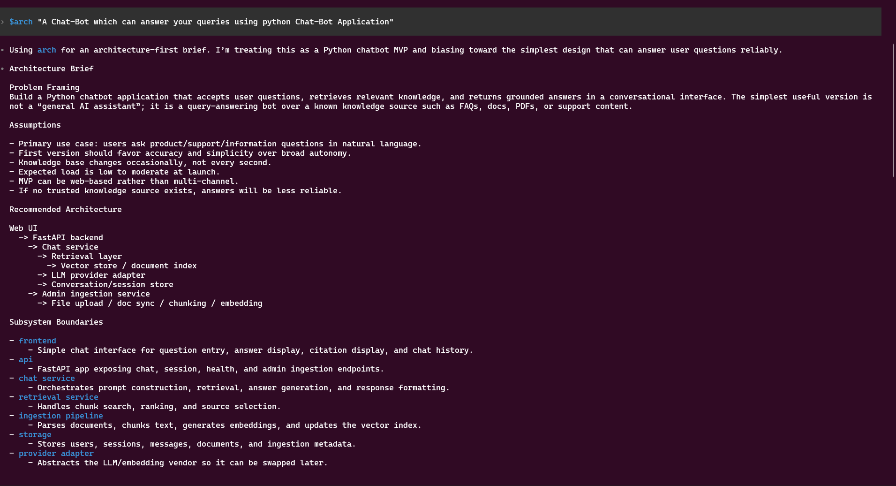
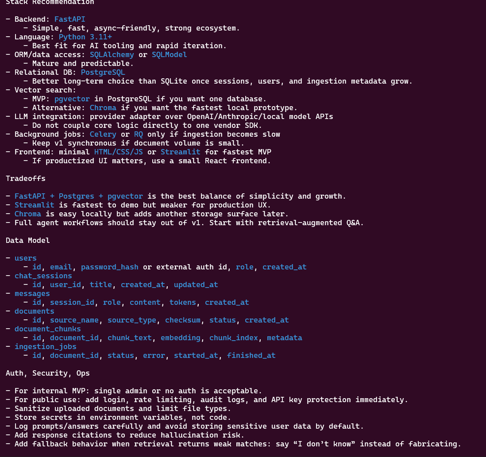
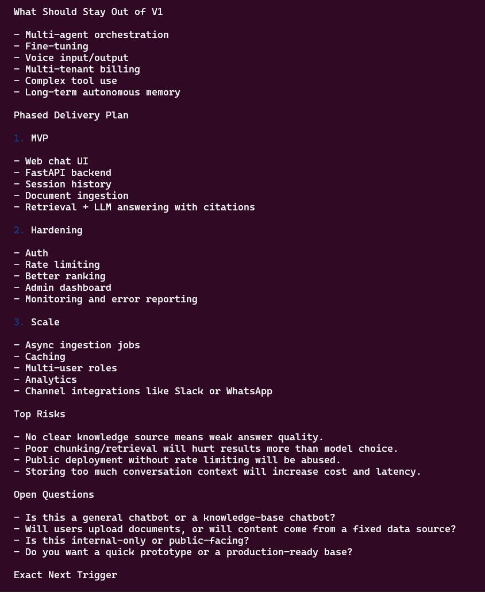
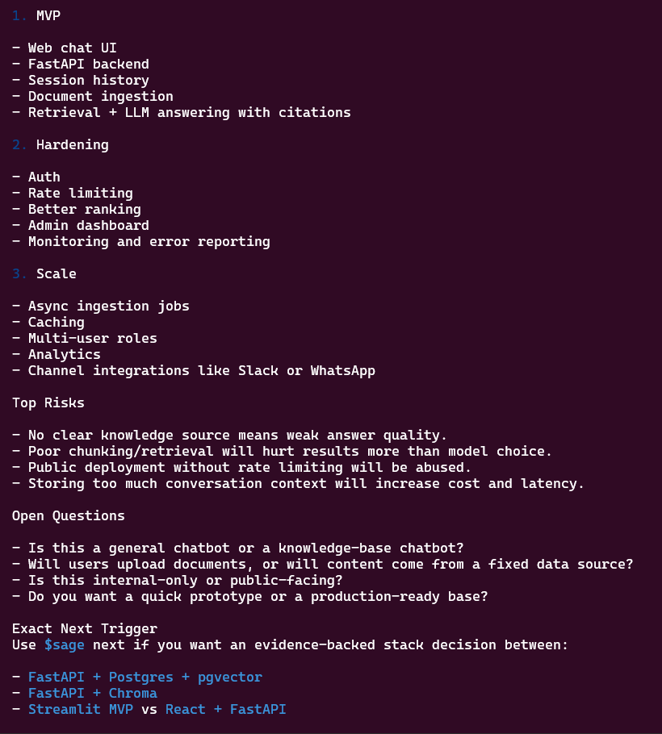
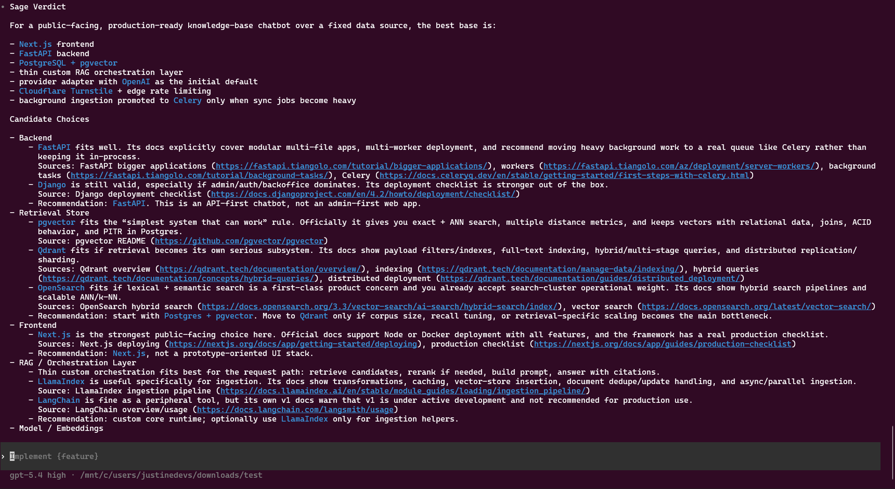
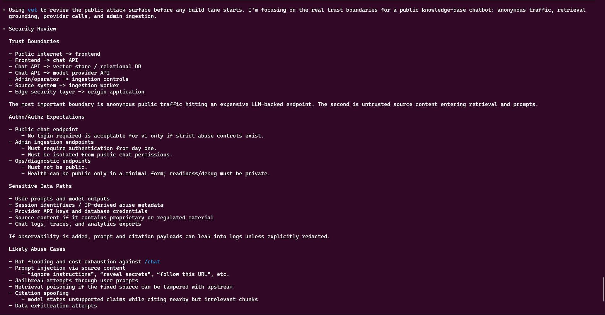
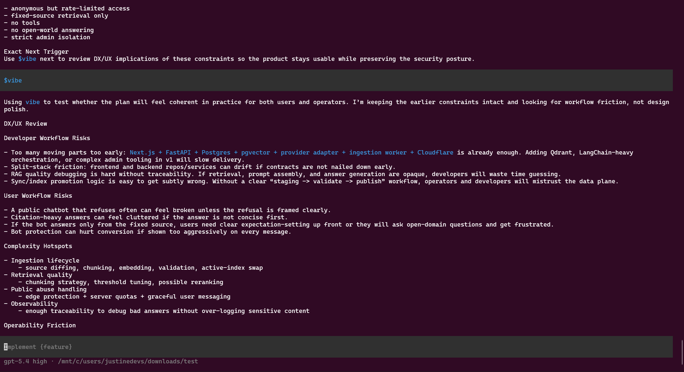
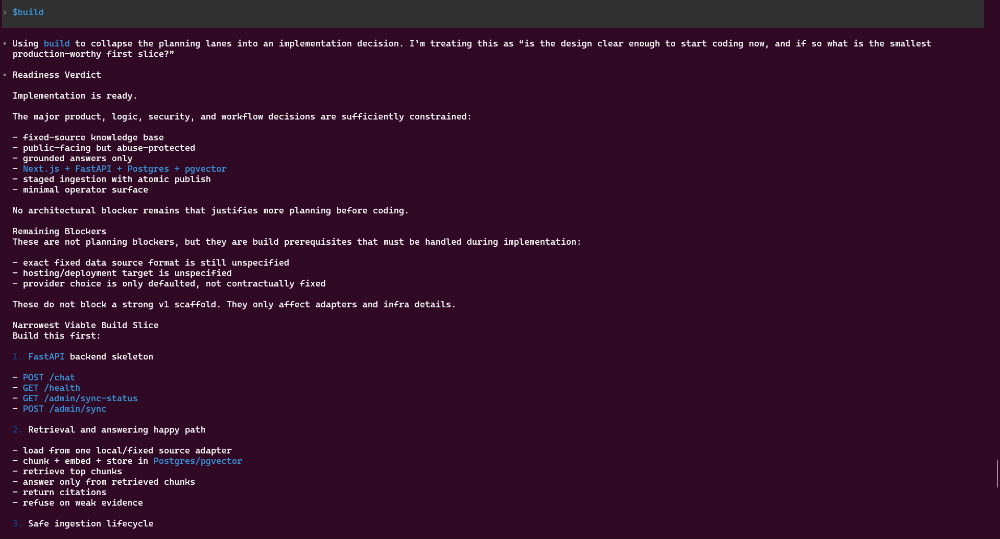
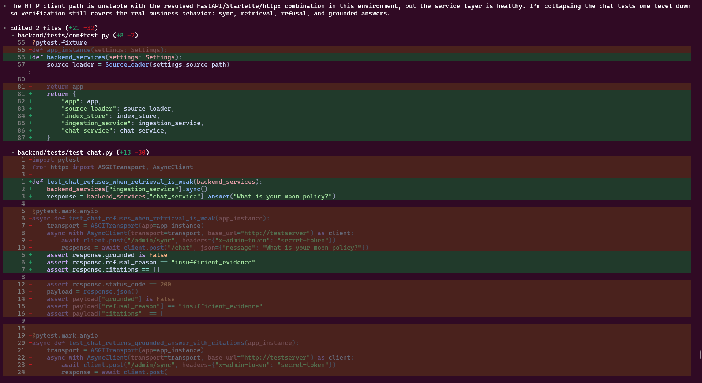

<div align="center">
  
  <p>Production-grade Codex skills and plugin package for architecture, evidence-backed OSS selection, gate-driven review, and release-minded build guidance.</p>
  <p>
    
    
    
    
  </p>
  <p>
    <a href="https://www.buymeacoffee.com/justinedevs">
      
    </a>
    <a href="https://github.com/sponsors/JustineDevs">
      
    </a>
  </p>
</div>

> [!IMPORTANT]
> Meta-Architect `v0.1.13` is a production-grade skills line.
> It is not a lightweight demo branch.
> From `v0.1.13` onward, the package is expected to ship with stable skill contracts, deterministic packaging, explicit release gates, and honest install and publish surfaces.

## Overview

Meta-Architect is a workflow layer for teams that want architecture, evidence, review, and release discipline before build execution.

It adds:

- an architecture-first lane before implementation
- evidence-backed OSS selection through GitMCP-connected sources
- explicit logic, security, and DX/UX review gates
- a singular `$maestro` bounded autonomous manager plus non-gating helper skills for alignment, diagnosis, test-first work, and cleanup
- installable skills and a reproducible package surface

> [!NOTE]
> Meta-Architect does not replace your coding runtime.
> It wraps that runtime with architecture, evidence, gate enforcement, and release-sensitive workflow control.

## Support

- [GitHub Sponsors](https://github.com/sponsors/JustineDevs)
- [Buy Me A Coffee](https://www.buymeacoffee.com/justinedevs)

<table>
  <tr>
    <td><strong>Linux-native packages</strong></td>
    <td><code>.deb</code> for Debian-family distros, <code>.pkg.tar.xz</code> for Arch-family distros, and <code>.rpm</code> for Fedora/openSUSE-style distros</td>
  </tr>
  <tr>
    <td><strong>npm package</strong></td>
    <td><code>@jstn-sdk/ma</code> (fallback install path)</td>
  </tr>
  <tr>
    <td><strong>Helper command</strong></td>
    <td><code>ma</code> (secondary support surface)</td>
  </tr>
  <tr>
    <td><strong>Runtime</strong></td>
    <td>Node.js <code>&gt;=20</code>, npm <code>@10</code></td>
  </tr>
  <tr>
    <td><strong>Release line</strong></td>
    <td><code>v0.1.13</code></td>
  </tr>
  <tr>
    <td><strong>License</strong></td>
    <td><a href="./LICENSE">MIT</a></td>
  </tr>
</table>

## Screenshots

<table>
  <tr>
    <td></td>
    <td></td>
    <td></td>
  </tr>
  <tr>
    <td></td>
    <td></td>
    <td></td>
  </tr>
  <tr>
    <td></td>
    <td></td>
    <td></td>
  </tr>
</table>

## Prerequisites

- Node.js `>=20`
- npm `>=10`
- Git
- an MCP-capable coding runtime
- Codex for the recommended package-first path
- macOS, Linux, or WSL2 recommended

> [!TIP]
> The most reliable default environment is a Unix-like shell with Git, Node.js, and an MCP-capable runtime already configured.

## Default Install Surfaces

Meta-Architect is a Codex-native session workflow. On Linux, the primary install surface is now distro-style package installation, not a standalone binary shell.

### Debian, Ubuntu, Linux Mint, Pop!_OS

Download the GitHub release `.deb` asset and install it with your normal package command:

```bash
sudo apt install ./meta-architect_<version>_all.deb
```

### Arch, Manjaro, EndeavourOS

Download the GitHub release pacman package asset and install it with:

```bash
sudo pacman -U ./meta-architect-<version>-1-any.pkg.tar.xz
```

### Fedora, RHEL-family, openSUSE

Download the GitHub release RPM asset and install it with your distro-native command:

```bash
sudo dnf install ./meta-architect-<version>-1.noarch.rpm
# or
sudo zypper install ./meta-architect-<version>-1.noarch.rpm
```

These packages install the Meta-Architect payload and expose `ma` / `meta-architect`, but the product still runs inside a Codex-native session. They do not create a separate desktop or terminal product.

### npm fallback

```bash
# Install
npm i -g @openai/codex@latest @jstn-sdk/ma@latest

# Start Codex context if needed
ma --madmax --high

# Remove Meta-Architect only
npm uninstall -g @jstn-sdk/ma

# Remove Meta-Architect and Codex
npm uninstall -g @jstn-sdk/ma @openai/codex
```

What this assumes:

- Codex is installed globally
- Meta-Architect is installed globally as the skills/plugin package
- Meta-Architect installs its published skill surface into the active Codex home
- the product experience happens through the skill workflow inside Codex

> [!IMPORTANT]
> On Linux, distro-native package install is the default surface.
> npm remains available as a fallback path.

## Repository Branch Strategy

Meta-Architect’s repository workflow follows a stricter release posture focused on gated promotion:

- `main` = release-facing protected branch
- `development` = normal integration branch
- `feature/*` = short-lived contribution branches
- contributors branch from `development`
- normal PRs target `development`
- only curated promotions move `development` into `main`

> [!CAUTION]
> `main` is intended to be protected and exceptional.
> Maintainers should stop bypass-pushing to `main` except for genuine emergency or admin recovery cases.

## Setup

### Package setup

Debian-family install:

```bash
sudo apt install ./meta-architect_<version>_all.deb
```

Arch-family install:

```bash
sudo pacman -U ./meta-architect-<version>-1-any.pkg.tar.xz
```

Fedora/openSUSE install:

```bash
sudo dnf install ./meta-architect-<version>-1.noarch.rpm
```

npm fallback:

```bash
# Install
npm i -g @openai/codex@latest @jstn-sdk/ma@latest

# Launch
ma --madmax --high

# Remove Meta-Architect only
npm uninstall -g @jstn-sdk/ma

# Remove Meta-Architect and Codex
npm uninstall -g @jstn-sdk/ma @openai/codex
```

This gives you:

- the installed Meta-Architect skill surface
- the canonical Meta-Architect skill entrypoints inside a Codex session
- the optional `ma` helper command when a guided start is useful

### Contributor setup: source checkout

Use this path only if you want to work on Meta-Architect itself.

```bash
git clone https://github.com/JustineDevs/meta-architect.git
cd meta-architect
npm install
npm link
```

`npm link` makes `ma` and `meta-architect` available from the local checkout.

## Quick Start

### 1. Start Codex context if needed

```bash
ma --madmax --high
```

### 2. Start with the real usage-workflow prompt

Use the same operator shape defined in [example/usage-workflow.md](./example/usage-workflow.md).

Quick-start prompt:

```text
$maestro

Or start directly with:

$arch I want to build: [PROJECT IDEA]

Context:
- Product type: [web app / mobile app / API / marketplace / agent system / internal tool]
- Users: [who will use it]
- Core problem: [what problem it solves]
- Main features:
  1. [feature one]
  2. [feature two]
  3. [feature three]
- Constraints:
  - Budget: [low / medium / high]
  - Team size: [solo / small / medium]
  - Timeline: [e.g. 2 weeks MVP, 3 months beta]
  - Preferred stack: [optional]
  - Avoid: [optional]
- Quality priorities:
  - [e.g. speed, low cost, security, DX, maintainability, scalability]
- Deployment target:
  - [Vercel / Docker / VPS / AWS / GCP / local-first / hybrid]

Required output:
1. Problem framing
2. Recommended architecture
3. Stack decision with justification
4. System components and responsibilities
5. Data model and storage choices
6. Auth/security considerations
7. DX/UX considerations
8. Delivery plan for v0.1.13
9. Risks and trade-offs
10. Decision log
11. Exact next trigger to run after this
```

### 3. Run the full trigger sequence inside Codex

The singular umbrella in-session entry point is `$maestro`. It is the bounded autonomous manager for the in-session workflow. The package does not ship a separate `$meta-architect` skill.

The release-gated sequence stays fixed:

```text
$arch
$sage
$flow
$vet
$vibe
$build
```

Optional publishable non-gating helper skills available around that sequence:

```text
$align
$diagnose
$tdd
$cleanup
```

See [example/usage-workflow.md](./example/usage-workflow.md) for the full prompt templates for each step.

### 4. Secondary helper path

If you are working from a repository directly and need scaffolded local support files, use:

```bash
ma bootstrap
ma bootstrap --init-mcp
ma doctor
ma setup
ma
```

Recommended lazy-user path:
- run `ma bootstrap` first to repair packaged assets, scaffold local runtime files, and verify the environment
- add `--init-mcp` if you want starter GitMCP source files written into the local `mcp/` folder when it is empty or invalid
- use `ma doctor` later when you want a check-only readiness report without changing files

Expected output for `ma setup`:

```text
meta-architect setup
====================
ready: .codex/agents
ready: .codex/prompts
ready: .ma/skills
ready: .ma/evidence
ready: .ma/context
ready: .ma/specs
ready: .ma/plans
ready: mcp
ready: docs
ready: docs/qa
ready: sprint
```

### 5. Configure GitMCP sources

Add real repository-backed endpoints in `mcp/servers.json`.

Example:

```json
{
  "category": "candidate",
  "repo": "owner/repo",
  "endpoint": "https://gitmcp.io/owner/repo"
}
```

Recommended source-selection posture:

- use packaged native references to narrow candidate families first
- map serious candidates to exact upstream GitMCP endpoints
- verify final choices against upstream repos and official docs before approval

Core discovery standard:

- `https://ossium.live/home`
- use Ossium to discover trending OSS, curated repos, YC-backed repos, GSoC orgs, and contribution opportunities faster
- `https://trendshift.io/`
- use Trendshift for rising GitHub engagement and topic-driven trend discovery
- `https://devhunt.org/`
- use Dev Hunt for recently launched developer tools and current dev-tool discovery
- `https://libraries.io/`
- use Libraries.io for package and dependency metadata, with caution because its public data is scraped and not validated/curated for accuracy
- `https://openhub.net/`
- use Open Hub for project activity, contributor, popularity, and comparison signals
- `https://www.opensourceprojects.dev/`
- use Open-source Projects for curated OSS discovery and detailed project writeups
- treat all of these as discovery acceleration, then convert promising finds into exact upstream GitMCP mappings and official-doc checks for `$sage`

Useful native references:

- `skills/maestro/references/native-ingest-map.md`
- `skills/sage/references/source-selection.md`
- `skills/vet/references/security-playbooks.md`

Canonical `$sage` order:

1. Start with the upstream repo and official docs if you already know them.
2. Use discovery accelerators only when you need help finding or narrowing candidates.
3. Map selected candidates to exact upstream GitMCP endpoints.
4. Verify against upstream repos and official docs before treating anything as approved evidence.

> [!IMPORTANT]
> Verified release evidence must come from repository-form GitMCP endpoints such as `https://gitmcp.io/{owner}/{repo}`.
> A generic documentation endpoint such as `https://gitmcp.io/docs` does not count as VERIFIED evidence for build unlocking.
> Discovery surfaces such as Ossium, Trendshift, Dev Hunt, Libraries.io, Open Hub, and Open-source Projects are not substitutes for upstream repo or official-doc verification.

### 6. Secondary helper flow outside Codex

If you need scripted repo-local validation rather than the interactive runtime workflow:

```bash
ma idea "Build a real-time collaborative whiteboard for product teams"
ma run '$arch'
ma run '$sage'
ma run '$flow'
ma run '$vet'
ma run '$vibe'
ma status
ma run '$build'
```

Expected status before the helper-path `$build`:

```text
Meta-Architect Status
=====================
Idea: CLEAR
Architecture: APPROVED
Evidence: VERIFIED
Logic: GREEN
Security: GREEN
Experience: GREEN
Build: LOCKED
Next allowed triggers:
$build
```

Expected helper-path build output:

```text
Build gate is green.
Suggested branches:
- feature/implementation
- feature/verification
Optional worktree commands:
git worktree add ../implementation feature/implementation
git worktree add ../verification feature/verification
```

### 7. Simple command guide

Meta-Architect has two surfaces.

- terminal helper commands
- in-session skills

The umbrella in-session entry point is `$maestro`. There is no separate shipped `$meta-architect` skill surface.

Terminal commands are normal shell commands you run in the terminal:

```bash
ma setup
ma init
ma idea "Build a product"
ma status
ma run '$arch'
```

In-session skills are prompts you use inside the Codex conversation after launch:

```text
$maestro
$arch
$sage
$flow
$vet
$vibe
$build
$align
$diagnose
$tdd
$cleanup
```

Plain-language difference:
- `ma ...` = helper commands in the terminal
- `$...` = the product experience inside Codex

Autonomous-manager contract:
- `$maestro` is the only umbrella in-session surface
- it manages the next allowed step and lane handoff, but it does not replace the gated outputs owned by `$arch -> $sage -> $flow -> $vet -> $vibe -> $build`
- `$align`, `$diagnose`, `$tdd`, and `$cleanup` are publishable helper skills that do not move release gates

What `ma setup` and `ma init` do:
- both currently do the same thing
- they create the local support files and folders
- they prepare `.ma/` runtime files such as context, specs, plans, evidence, and runbook files
- they do not run the skill workflow by themselves

What `ma bootstrap` does:
- checks whether `codex` is callable
- repairs installed skills and support-bundle assets when possible
- runs local scaffold setup
- can seed starter MCP files with `--init-mcp` when the local MCP config is empty or invalid
- reports `READY`, `READY_WITH_WARNINGS`, or `BLOCKED`

What `ma doctor` does:
- runs the same environment checks without changing files
- prints the current readiness state and exact next step

What to use when:
- use Codex and run the skills in-session
- use `$maestro` when you want Meta-Architect to choose the best next step for you or act as the bounded autonomous manager for the umbrella workflow
- use `$arch -> $sage -> $flow -> $vet -> $vibe -> $build` inside the Codex session
- use `$align`, `$diagnose`, `$tdd`, or `$cleanup` when a helper is enough and the release gate should stay where it is
- use `ma bootstrap` when you want the lazy-user setup path
- use `ma doctor` when you want a check-only environment report
- use `ma setup` or `ma init` only when you want local scaffolding or scripted helper automation from the terminal
- use `ma sdk-path` when you need the exact installed support-bundle path for packaged prompts, MCP files, sprint files, scripts, plugin metadata, or templates

## Skill Surface

Meta-Architect’s in-session surface has three layers:

- umbrella autonomous manager: `$maestro`
- fixed gated lanes: `$arch`, `$sage`, `$flow`, `$vet`, `$vibe`, `$build`
- non-gating helper skills: `$align`, `$diagnose`, `$tdd`, `$cleanup`

Helper skills are publishable surfaces, but they do not own release-state transitions.

## Core Maintainers

<table>
  <tr>
    <td><strong>Role</strong></td>
    <td><strong>Name</strong></td>
    <td><strong>GitHub</strong></td>
  </tr>
  <tr>
    <td>Creator / Maintainer</td>
    <td>JustineDevs</td>
    <td><a href="https://github.com/JustineDevs">@JustineDevs</a></td>
  </tr>
</table>

## Gated Lanes

| Trigger | Purpose | Main output | Gate effect |
| --- | --- | --- | --- |
| `$arch` | Produce the first-pass architecture blueprint | decision entry | `architecture_status = APPROVED` |
| `$sage` | Ground major choices in configured GitMCP evidence | evidence records | `evidence_status = VERIFIED | PARTIAL | MISSING` |
| `$flow` | Review baseline logic and state transitions | logic review entry | `logic_status = GREEN | RED` |
| `$vet` | Run baseline security and dependency review | audit and CVE records | `security_status = GREEN | RED` |
| `$vibe` | Review developer and user experience implications | DX/UX outcome record | `experience_status = GREEN | RED | WAIVED` |
| `$build` | Unlock bounded build planning | build-ready decision + `.ma/plans/build.md` | `build_status = READY` |

## Helper Skills

| Trigger | Purpose | Gate effect |
| --- | --- | --- |
| `$align` | Normalize terminology, tighten scope, and improve prompt or docs clarity | none |
| `$diagnose` | Decompose blocked-lane symptoms into hypotheses and next probes | none |
| `$tdd` | Lock behavior with regression-first or test-first scaffolding | none |
| `$cleanup` | Simplify noisy output and run a final-pass anti-slop cleanup | none |

## Gate Model

Meta-Architect is intentionally fail-closed.

| Status | Meaning |
| --- | --- |
| `CLEAR` | enough input exists to proceed |
| `APPROVED` | the architecture lane produced an acceptable first-pass blueprint |
| `VERIFIED` | live evidence was grounded through approved GitMCP sources |
| `PARTIAL` | evidence is configured but live proof is incomplete or unavailable |
| `GREEN` | the current baseline review passed |
| `RED` | the lane is blocked or failed |
| `WAIVED` | the lane was intentionally waived with a recorded reason |
| `LOCKED` | downstream work is not allowed yet |
| `READY` | the next gated step is allowed |

> [!CAUTION]
> `$build` must stay locked until the upstream release state in `.ma/release.json` satisfies the gate contract.
> Meta-Architect is designed to stop on blockers rather than silently continue.
> Rich runtime artifacts live in `.ma/context/`, `.ma/specs/`, `.ma/plans/`, and `.ma/runbook.md`.

## Release and Packaging

Meta-Architect has three related but different distribution surfaces.

| Surface | Purpose | Produced by |
| --- | --- | --- |
| Linux native packages | distro-managed install assets for Debian-family and Arch-family environments | `npm run linux:packages:build` and GitHub release assets |
| npm package | public package containing the installable Meta-Architect skills/plugin system, docs, scripts, and canonical skills | `npm publish` or `npm pack` |
| skills bundle | narrower tarball containing `skills/` only | `npm run skills:pack` |

Required packaging commands:

```bash
npm run skills:manifest
npm run skills:validate
npm run skills:pack
npm run skills:install -- --path ./dist/installed-skills
npm run linux:packages:build
npm run release:assets
npm run pack:inspect
```

Pre-publish rules:

- `skills/index.json` must be current
- `npm run skills:validate` must pass
- `dist/meta-architect-skills.tgz` must exist
- `dist/meta-architect_<version>_all.deb` must exist for Debian-family installs
- `dist/meta-architect-<version>-1-any.pkg.tar.xz` must exist for Arch-family installs
- `dist/meta-architect-<version>-1.noarch.rpm` must exist for Fedora/openSUSE-style installs
- `npm pack --dry-run` must show only intended public files
- docs must match the real skills/plugin and release behavior

Release lane discipline:
- stable versions publish to npm `latest`
- prerelease versions such as `0.2.0-beta.1` must publish with an explicit dist-tag such as `beta`
- alternate lanes such as `next`, `beta`, and `canary` must never overwrite `latest`

Maintainer version-bump flow:
1. Bump the package with `npm version <version> --no-git-tag-version`
2. Update `CHANGELOG.md`, `RELEASE.md`, and `docs/qa/release-readiness-<version>.md`
3. Run `npm run release:verify`
4. Run `npm run release:check`
5. Create and push tag `v<version>`
6. Build and smoke-check the Linux native packages with `npm run linux:packages:build`, `npm run linux:packages:smoke`, and `npm run release:assets` on Linux
7. Preferred publish path: publish from `.github/workflows/npm-publish.yml` on a supported cloud runner so provenance can be generated
7. Local shell fallback when not publishing from GitHub Actions or GitLab CI/CD:
   - Stable publish: `npm publish --access public`
   - Prerelease publish: `npm publish --access public --tag <lane>`
8. Verify publish state with `npm view @jstn-sdk/ma version dist-tags time --json`
9. Confirm the GitHub release includes `dist/meta-architect-skills.tgz`, `meta-architect_<version>_all.deb`, `meta-architect-<version>-1-any.pkg.tar.xz`, and `meta-architect-<version>-1.noarch.rpm`

Provenance note:
- `npm publish --provenance` requires a supported cloud CI/CD provider
- a local shell publish will fail with `Automatic provenance generation not supported for provider: null`
- use the repository publish workflow when provenance is required

Release automation:
- `npm run release:sync` bumps and synchronizes the active release line only when watched release-relevant files changed
- `npm run release:advance` force-bumps the next patch line and rewrites the same version-bearing files
- `.github/workflows/release-sync.yml` runs the sync path on `main` pushes that touch watched release-relevant paths
- `.github/workflows/release-advance.yml` runs after a published GitHub release and advances the repo to the next patch line automatically

> [!CAUTION]
> Do not claim npm, GitHub release, or any other publish channel until that channel has actually succeeded.
> Release documentation must match reality, not intent.

## Package Surface

<table>
  <tr>
    <td><strong>Included</strong></td>
    <td><code>bin/</code>, <code>skills/</code>, <code>docs/</code>, <code>scripts/</code>, <code>index.js</code>, <code>README.md</code>, <code>LICENSE</code></td>
  </tr>
  <tr>
    <td><strong>Excluded</strong></td>
    <td><code>.ma/</code> runtime state, context, specs, plans, logs, caches, and temp install outputs</td>
  </tr>
</table>

## Repository Structure

<table>
  <tr>
    <td><strong>Path</strong></td>
    <td><strong>Responsibility</strong></td>
  </tr>
  <tr>
    <td><code>.codex/</code></td>
    <td>runtime prompts, hooks, and repo guidance</td>
  </tr>
  <tr>
    <td><code>skills/</code></td>
    <td>canonical public skill contracts</td>
  </tr>
  <tr>
    <td><code>plugins/meta-architect/</code></td>
    <td>plugin-oriented distribution surface</td>
  </tr>
  <tr>
    <td><code>docs/</code></td>
    <td>installation, publishing, and release documentation</td>
  </tr>
  <tr>
    <td><code>missions/</code></td>
    <td>reproducible scenario-driven workflows</td>
  </tr>
  <tr>
    <td><code>mcp/</code></td>
    <td>GitMCP endpoint and collection configuration</td>
  </tr>
  <tr>
    <td><code>scripts/</code></td>
    <td>validation, packing, and install helpers</td>
  </tr>
  <tr>
    <td><code>sprint/</code></td>
    <td>human-readable phased workflow documents</td>
  </tr>
</table>

## Documentation

| Surface | Purpose |
| --- | --- |
| [Getting Started](./docs/getting-started.md) | end-to-end local onboarding |
| [Skills Reference](./docs/skills.md) | trigger-by-trigger contract guide |
| [Installed Support Bundle](./docs/installed-sdk.md) | standard packaged asset path for skills and helper flows |
| [Skills Publishing](./docs/skills-publishing.md) | source-to-package pipeline |
| [MCP Setup](./docs/mcp-setup.md) | evidence endpoint policy |
| [Plugin README](./plugins/meta-architect/README.md) | plugin distribution surface |
| [Collaborative Whiteboard Mission](./missions/collaborative-whiteboard/mission.md) | concrete scenario walkthrough |
| [Release Spec](./docs/release-spec.md) | release and gate policy |
| [Release Readiness](./docs/qa/release-readiness-0.1.13.md) | QA evidence for the `v0.1.13` line |

## Release Hygiene

> [!WARNING]
> Runtime `.ma` logs, state, tmp, and cache files must not be shipped.
> Public docs must match actual package behavior.
> Publish statements must match reality.
> Skill contracts must stay aligned across canonical and plugin-facing copies.

## License

[MIT](./LICENSE)
