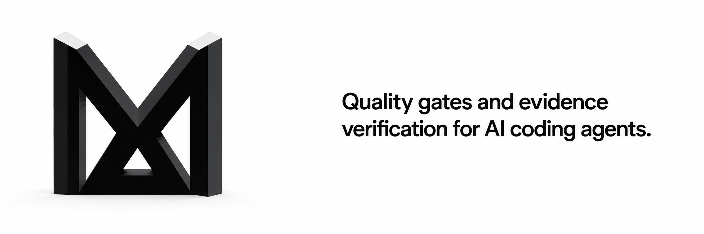
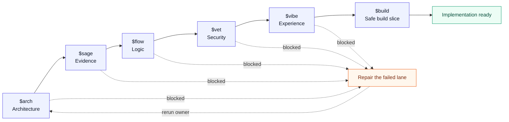

<div align="center">
  
  <h1>Meta-Architect</h1>
  <p><strong>Quality gates and evidence verification for AI coding agents.</strong></p>
  <p>Your agent writes code fast. Meta-Architect makes it prove each stage first. Design, evidence, logic, security, experience, build. Each gate stays locked until the one before it passes.</p>
  <p>
    
    
    
    <a href="https://badge.socket.dev/npm/package/@jstn-sdk/ma/0.15.3">
      
    </a>
    <a href="https://security.snyk.io/package/npm/%252540jstn-sdk%25252Fma">
      
    </a>
    <a href="https://www.buymeacoffee.com/justinedevs">
      
    </a>
    <a href="https://github.com/sponsors/JustineDevs">
      
    </a>
  </p>
  <table>
    <tr>
      <td><a href="#setup">Quick Start</a></td>
      <td><a href="./DEMO.md">Demo</a></td>
      <td><a href="./COVERAGE.md">Verified Coverage</a></td>
      <td><a href="./SECURITY.md">Security</a></td>
      <td><a href="#how-do-i-contribute">Contributing</a></td>
      <td><a href="https://github.com/JustineDevs/meta-architect/issues">Issues</a></td>
    </tr>
  </table>
</div>

> [!NOTE]
> Meta-Architect is a workflow layer for teams that want architecture, evidence, review, and release discipline before build execution.
> Meta-Architect does not replace your coding runtime.
> It wraps that runtime with architecture, evidence, gate enforcement, and release-sensitive workflow control.
> Meta-Architect is an architecture-governance and execution-verification layer that helps AI coding agents design scalable, secure, and resilient systems by making business goals, constraints, trade-offs, evidence, and quality gates explicit.


<a id="setup"></a>

## 🧩 Setup

### Install and start

Requires Node.js 20+ and a TypeSafe API key for autonomous Maestro routing.

```bash
npm install --global @jstn-sdk/ma@latest
ma auth typesafe
# Enter the key once when prompted. It is stored owner-only at
# ~/.config/meta-architect/provider.env (or $XDG_CONFIG_HOME/meta-architect/provider.env).
ma setup
ma --madmax --high
```

For a project-local dotenv setup, create `.env.local` in the project root:

```dotenv
TYPESAFE_API_KEY=jv_live_your_key
```

Keep `.env.local` out of version control. Meta-Architect reads `.env.local`,
then `.env`, then the global credential file; explicit environment variables
still take precedence. The default `jev-latest` model is selected automatically;
no model setting is required. Check the resolved source without revealing the key:

```bash
ma auth typesafe --status
```

Then give Maestro the project goal inside your AI coding agent:

```text
$maestro I want to build: [your project idea]
```

`ma setup` detects the active host, installs the compatible Meta-Architect
surface, and writes project state to `.ma/`. The credential is never written
to `.ma/`, receipts, logs, or generated context.

### End-to-end example

After setup, the normal workflow is one goal, not a manually selected lane
sequence:

```bash
ma setup
```

```bash
ma --madmax --high
```

Inside the AI coding agent, state the goal once:

```text
$maestro Build a multi-tenant analytics API with authentication and tests.
```

When the local Maestro runtime is running with the live provider configured,
Maestro reads the current `.ma/` state, asks Jev to choose the next eligible
action, dispatches the owning lane, records evidence, and repeats the
decision-execute-verify loop. The user does not need to manually run
`$arch`, `$sage`, `$flow`, `$vet`, `$vibe`, or `$build`.

Loading `$maestro` as an in-session skill alone does not call Jev. Report
`provider use: not verified` unless a successful local Maestro receipt records
the provider decision.

```text
$maestro
  -> selects the next eligible lane
  -> executes the lane
  -> verifies the result
  -> records evidence
  -> continues until complete or blocked
```

Inspect the current state at any time:

```bash
ma status
```

```bash
ma doctor
```

Maestro stops for missing credentials, destructive operations, deployments,
or explicit approval gates. Interrupted work resumes from the persisted `.ma/`
state.

### AI agent installation prompt

Copy and paste this prompt into your AI coding agent:

```text
Install Meta-Architect for this project.

1. Detect the current AI host and its native project configuration surface.
2. Install or update `@jstn-sdk/ma@latest` using the host's supported package manager.
3. Set `MA_AGENT` to the detected host ID when a host-specific surface is available.
4. Run `ma setup` and accept the detected project scope and targets.
5. Verify the generated `.ma/` state and native host artifacts.
6. Report the installed version, selected host, generated files, and any unsupported capabilities.

Do not overwrite user-owned files, modify unrelated configuration, or claim a host is supported without verification.
```

### Alternative Installation
| ✅ Recommended | 🧰 All available installation commands |
| --- | --- |
| Use the signed jsDelivr installer on macOS, Linux, WSL, or Git Bash.<br><br>`curl -fsSLo install.sh https://cdn.jsdelivr.net/gh/JustineDevs/meta-architect@latest/scripts/install.sh`<br><br>`curl -fsSLo install.sh.sha256 https://cdn.jsdelivr.net/gh/JustineDevs/meta-architect@latest/scripts/install.sh.sha256`<br><br>`sed 's#scripts/install.sh#install.sh#' install.sh.sha256 \| sha256sum -c -`<br><br>`sh install.sh`<br><br>`ma --madmax --high`<br><br>`$maestro I want to build: [your project idea]` | **npm global**<br><br>`npm i -g @openai/codex@latest @jstn-sdk/ma@latest`<br><br>**Meta-Architect only**<br><br>`npm i -g @jstn-sdk/ma@latest`<br><br>**Windows PowerShell**<br><br>`npm i -g @openai/codex@latest @jstn-sdk/ma@latest`<br><br>**Debian / Ubuntu**<br><br>`sudo apt install ./meta-architect_&lt;version&gt;_all.deb`<br><br>**Arch Linux**<br><br>`sudo pacman -U ./meta-architect-&lt;version&gt;-1-any.pkg.tar.xz`<br><br>**Fedora / openSUSE**<br><br>`sudo dnf install ./meta-architect-&lt;version&gt;-1.noarch.rpm` |

More install options: [docs/getting-started.md](./docs/getting-started.md)

Uninstall Meta-Architect: `npm uninstall -g @jstn-sdk/ma`
Uninstall Meta-Architect and Codex: `npm uninstall -g @jstn-sdk/ma @openai/codex`

### Install into an AI vendor host

Install Meta-Architect once, then select the host surface before launch. The
pre-launch step detects installed hosts and writes the selected scope and
targets to `.ma/prelaunch.json`.

```bash
# Codex (reference host)
npm i -g @openai/codex@latest @jstn-sdk/ma@latest
ma --madmax --high

# Claude Code
MA_AGENT=claude-code npm i -g @jstn-sdk/ma@latest
MA_AGENT=claude-code ma --madmax --high

# Cursor
MA_AGENT=cursor npm i -g @jstn-sdk/ma@latest
MA_AGENT=cursor ma --madmax --high

# Any registered host surface
MA_AGENT=<host-id> npm i -g @jstn-sdk/ma@latest
MA_AGENT=<host-id> ma --madmax --high
```

MA installs or reuses the native skill/configuration surface for the selected
host and keeps the canonical workflow unchanged. See the [host compatibility
evidence](./docs/agent-compat-integration-report.md) for supported surfaces.

### Claude Code marketplace

The repository includes a hosted Claude Code marketplace for the existing
`plugins/meta-architect` bundle:

```text
/plugin marketplace add JustineDevs/meta-architect
/plugin install meta-architect@meta-architect
```

### ChatGPT Desktop local marketplace

ChatGPT Desktop cannot resolve direct filesystem links to local Codex skills.
The canonical `$maestro` source is the
[remote GitHub skill file](https://github.com/JustineDevs/meta-architect/blob/main/plugins/meta-architect/skills/maestro/SKILL.md).
Install the portable plugin through the repository marketplace instead:

```bash
npm run plugin:validate
codex plugin marketplace add ./
```

Restart ChatGPT Desktop, open Plugins, select the local Meta-Architect
marketplace, and install **Meta-Architect**. Use the installed plugin or its
available `@` mention with a normal request such as:

```text
Use Meta-Architect Maestro to choose the next safe workflow step for this task.
```

The Desktop plugin packages the skills only. Live local `ma` and Jev
execution still requires the local Codex/Node runtime; hosted ChatGPT Work
execution requires a separately deployed authenticated MCP app. See the
[ChatGPT integration guide](./docs/chatgpt-integration.md).

### Zero-config MCP setup

Meta-Architect exposes a production, read-only MCP server at
`https://ma.jstn.site/mcp`. “Zero-config” means no project files, API keys, or
vendor-specific wrapper code are required: register the URL with the host you
already use.

#### Codex

```bash
codex mcp add meta-architect --url https://ma.jstn.site/mcp
codex mcp list
```

#### Claude Code

```bash
claude mcp add --transport http meta-architect https://ma.jstn.site/mcp
claude mcp list
```

Run `/mcp` inside Claude Code to confirm the connection. Use `--scope user`
when the server should be available across Claude Code projects:

```bash
claude mcp add --transport http --scope user meta-architect https://ma.jstn.site/mcp
```

#### Cursor

Add the server to `~/.cursor/mcp.json`:

```json
{
  "mcpServers": {
    "meta-architect": {
      "url": "https://ma.jstn.site/mcp"
    }
  }
}
```

#### VS Code with GitHub Copilot Agent mode

Add `.vscode/mcp.json` to the project:

```json
{
  "servers": {
    "meta-architect": {
      "type": "http",
      "url": "https://ma.jstn.site/mcp"
    }
  }
}
```

ChatGPT developer mode uses the same URL in its MCP connection form. No
additional local configuration is needed. The server exposes only read-only
workflow guidance tools and does not access or modify the connected project.

These examples follow the host contracts documented by [OpenAI Docs MCP](https://developers.openai.com/learn/docs-mcp), [OpenAI plugin MCP guidance](https://developers.openai.com/plugins/build/mcp-server), and [Claude Code MCP documentation](https://docs.anthropic.com/en/docs/claude-code/mcp).

## Product details

<details>
<summary><strong>🔌 All 33 plugins & features</strong></summary>

The plugin and feature inventory is maintained in the [support bundle manifest](./support-bundle.json) and [skills manifest](./skills/index.json), with verification in the [coverage documentation](./COVERAGE.md).
</details>

<details>
<summary><strong>Why do AI coding agents need gates?</strong></summary>

Your agent writes code faster than you review it. Studies and dev surveys keep finding the same failures:

- Plausible code with wrong logic
- Imports of packages which don't exist
- Outdated APIs from training cutoffs
- "Done" claims with zero proof

Meta-Architect blocks each one:

- No architecture without a decision record. `$arch` writes the blueprint and the trade-offs.
- No stack claims without evidence. `$sage` grades every dependency claim VERIFIED, PARTIAL, or MISSING against upstream repos through GitMCP.
- No build while a gate is red. Logic, security, and DX reviews fail closed.
- No release claims without proof. Releases need issue-linked, production-verified evidence.

## What is Meta-Architect?

An open-source workflow governor for AI coding agents. You install it as a skill package in your agent host. It adds six gated lanes plus `$maestro`, a bounded manager which routes your work through them. It doesn't replace your agent, runtime, or model. It governs what they produce.

| Fact | Value |
| --- | --- |
| Type | Skill and plugin package for AI coding agent hosts |
| Reference host | Codex (full support) |
| Compatibility scope | Codex, OpenCode, Gemini CLI, Amp, Claude Code, Goose, Hermes, Pi, Cursor, Windsurf, Cline, Continue, Roo, Kiro CLI, Junie, GitHub Copilot, and Antigravity ([coverage evidence](./docs/agent-compat-integration-report.md)) |
| Runtime | Node.js 20+ |
| Install | `npm i -g @jstn-sdk/ma` |
| Evidence sources | GitMCP / MCP endpoints |
| License | MIT |

## How does it work?

State your intent once. `$maestro` picks the next safe step and stops when something fails.

```text
$maestro I want to build: a multi-tenant analytics API for logistics customers
```

```text
Meta-Architect Status
=====================
Idea: CLEAR
Architecture: APPROVED
Evidence: VERIFIED
Logic: GREEN
Security: GREEN
Experience: GREEN
Build: LOCKED
```

Build stays LOCKED until every upstream gate passes. Red stays red.

## The six gates


```mermaid
flowchart LR
    A["$arch<br/>Architecture"] --> B["$sage<br/>Evidence"]
    B --> C["$flow<br/>Logic"]
    C --> D["$vet<br/>Security"]
    D --> E["$vibe<br/>Experience"]
    E --> F["$build<br/>Safe build slice"]
    F --> G["Implementation ready"]

    A -. "blocked" .-> R["Repair the failed lane"]
    B -. "blocked" .-> R
    C -. "blocked" .-> R
    D -. "blocked" .-> R
    E -. "blocked" .-> R
    R -. "rerun owner" .-> A

    classDef gate fill:#eef2ff,stroke:#4f46e5,color:#111827
    classDef outcome fill:#ecfdf5,stroke:#059669,color:#064e3b
    classDef repair fill:#fff7ed,stroke:#ea580c,color:#7c2d12
    class A,B,C,D,E,F gate
    class G outcome
    class R repair
```

Each gate owns one decision. A failed gate sends work back to the lane that can
repair it. `$build` stays locked until the earlier gates pass.

Four helpers support the lanes without moving gates: `$align`, `$diagnose`, `$tdd`, `$cleanup`.

### How is it different from Spec Kit, BMAD, or Agent OS?

Spec-driven tools structure what your agent writes. Meta-Architect enforces what your agent proves.

| | Spec Kit | BMAD | Agent OS | Meta-Architect |
| --- | --- | --- | --- | --- |
| Structured workflow | Yes | Yes | Yes | Yes |
| Gates which block | No | No | No | Yes |
| External evidence verification | No | No | No | Yes, GitMCP-graded |
| Learning loop with promotion rules | No | No | No | Yes |
| Multi-host | Yes | Yes | Yes | Codex today, expanding |

Already using a spec tool? Keep it. Their specs become inputs. MA's gates verify the execution.

</details>

## Who is it for?

- Solo builders shipping with AI agents who want release discipline without enterprise process
- OSS contributors who need stack decisions they defend in review
- Skip it if you want an unattended agent writing code. MA governs your agent. It isn't one.

## How do I contribute?

1. Open an issue before a PR. It saves rework.
2. Start here: [issues labeled `triage`](https://github.com/JustineDevs/meta-architect/issues)
3. Make changes on `dev`; `main` is protected and release-facing. Automation
   branches are ephemeral workflow artifacts, not developer branches.
4. Run `npm test` before you submit. Follow [CONTRIBUTING.md](./CONTRIBUTING.md).
5. AI-assisted PRs welcome. Explain every line you submit or expect a close.

See the [Code of Conduct](./CODE_OF_CONDUCT.md) and [security policy](./SECURITY.md)
for participation and private vulnerability reporting.

<div align="center">
  <h2>Learn more</h2>
  <table>
    <tr>
      <td><a href="./docs/getting-started.md">Getting started</a></td>
      <td><a href="./docs/skills.md">Skills reference</a></td>
      <td><a href="./DEMO.md">Demo</a></td>
    </tr>
    <tr>
      <td><a href="./COVERAGE.md">Coverage matrix</a></td>
      <td><a href="./docs/disk-optimization.md">Disk-bounded tests</a></td>
      <td><a href="./docs/release-spec.md">Release spec</a></td>
    </tr>
    <tr>
      <td><a href="./docs/mcp-setup.md">MCP setup</a></td>
      <td><a href="./docs/chatgpt-integration.md">ChatGPT integration</a></td>
      <td><a href="./CONTRIBUTING.md">Contributing</a></td>
    </tr>
  </table>
  <p>
    <a href="./SECURITY.md">Security reporting</a> ·
    <a href="./docs/ossf-best-practices.md">OpenSSF Best Practices evidence</a>
  </p>
</div>

<div align="center">
  <h2>License</h2>
  <p><a href="./LICENSE">MIT</a>. Built by <a href="https://github.com/JustineDevs">@JustineDevs</a>.</p>
</div>

<p align="center">
  <sub>Found a bad claim before it shipped? <a href="https://github.com/JustineDevs/meta-architect">Star the repo</a>. It helps other developers find it.</sub>
</p>
